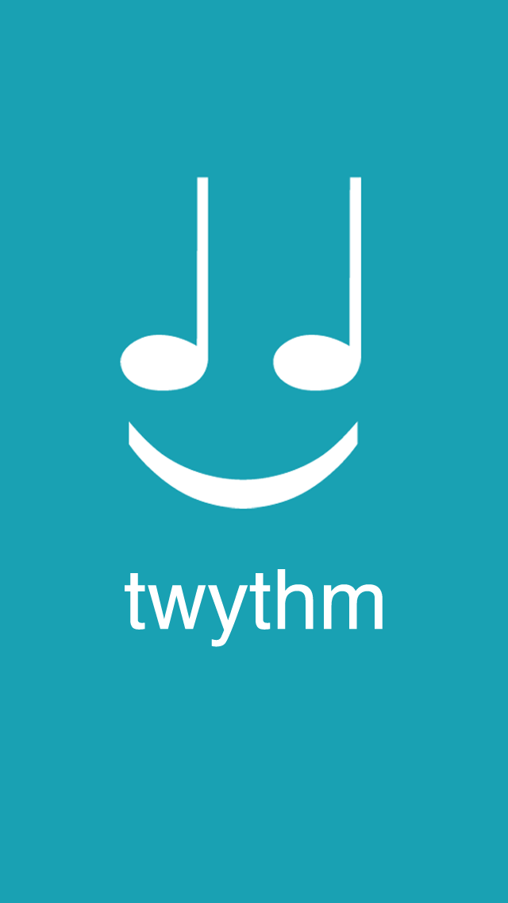

# Twythm

Twythm is an app developed by Ben Thomson and I. In 2012, we identified a problem: there is no easy way to share music on Twitter. Twythm, an innovative iOS app, is our solution. When a user shares a song using Twythm, it doesn't just share the title- it tweets a dynamic webpage contaning links to listen to and buy the song on YouTube, iTunes, Spotify, among others. These webpages are generated on the fly and cached for future users to access quickly. This project taught us the basics of designing, developing, and marketing an app. The iOS app is written in Objective-C and the backend is written in PHP and mySQL.

